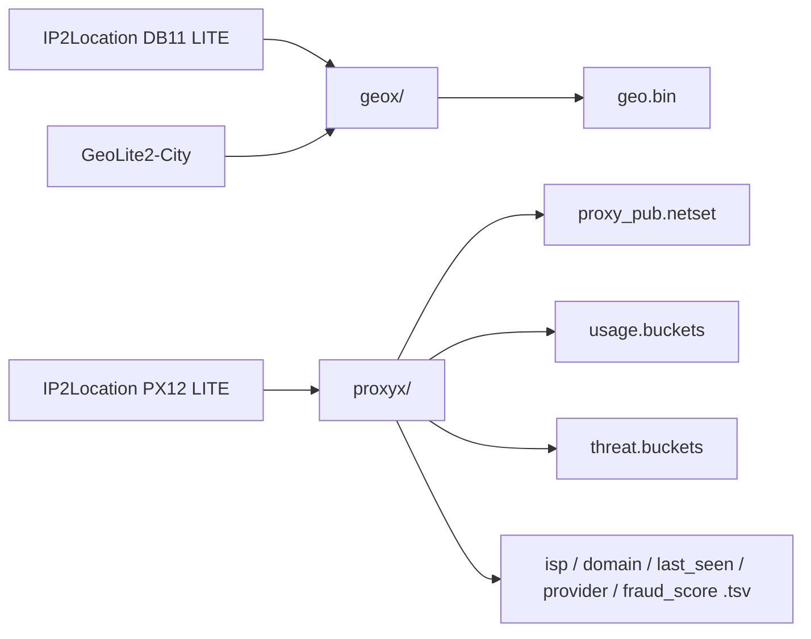

# IP2X

[](https://github.com/tn3w/IP2X/actions)
[](https://github.com/tn3w/IP2X/releases/latest)
[](https://github.com/tn3w/IP2X/releases/latest)
[](#artifacts)
[](#artifacts)
[](#attribution)
[](LICENSE)

[](https://github.com/tn3w/IP2X/releases/latest/download/geo.bin)
[](https://github.com/tn3w/IP2X/releases/latest/download/proxy_pub.netset)
[](https://github.com/tn3w/IP2X/releases/latest/download/usage.buckets)
[](https://github.com/tn3w/IP2X/releases/latest/download/threat.buckets)
[](https://github.com/tn3w/IP2X/releases/latest/download/isp.tsv)
[](https://github.com/tn3w/IP2X/releases/latest/download/domain.tsv)
[](https://github.com/tn3w/IP2X/releases/latest/download/last_seen.tsv)
[](https://github.com/tn3w/IP2X/releases/latest/download/provider.tsv)
[](https://github.com/tn3w/IP2X/releases/latest/download/fraud_score.tsv)

Public IP intel from IP2Location LITE, repacked for fast offline use.
Two crates, two output styles: a 42 MB mmap geo DB and a set of plain-text
proxy views, each file ≤ 38 MB.

```bash
wget https://github.com/tn3w/IP2X/releases/latest/download/geo.bin
wget https://github.com/tn3w/IP2X/releases/latest/download/proxy_pub.netset
wget https://github.com/tn3w/IP2X/releases/latest/download/usage.buckets
wget https://github.com/tn3w/IP2X/releases/latest/download/threat.buckets
wget https://github.com/tn3w/IP2X/releases/latest/download/isp.tsv
wget https://github.com/tn3w/IP2X/releases/latest/download/domain.tsv
wget https://github.com/tn3w/IP2X/releases/latest/download/last_seen.tsv
wget https://github.com/tn3w/IP2X/releases/latest/download/provider.tsv
wget https://github.com/tn3w/IP2X/releases/latest/download/fraud_score.tsv
```

Updated daily via GitHub Actions.

## Artifacts

| file | role | size |
| ---- | ---- | ---: |
| `geo.bin`            | mmap DB, IP → (lat, lon) at 0.001° | ~42 MB |
| `proxy_pub.netset`   | CIDR netset, public proxies (proxy_type == PUB) | ~31 MB |
| `usage.buckets`      | IP → usage  (bucketed per value)    | ~27 MB |
| `threat.buckets`     | IP → threat (bucketed per value)    | ~0.5 MB |
| `isp.tsv`            | IP → ISP            (dict + ranges) | ~34 MB |
| `domain.tsv`         | IP → domain         (dict + ranges) | ~33 MB |
| `last_seen.tsv`      | IP → last-seen days (dict + ranges) | ~38 MB |
| `provider.tsv`       | IP → VPN provider   (dict + ranges) | ~0.3 MB |
| `fraud_score.tsv`    | IP → fraud score    (dict + ranges) | ~37 MB |

# geo.bin

Built by [`geox/`](geox/) from IP2Location DB11 LITE (preferred) +
MaxMind GeoLite2-City (fallback). Coordinates quantised to 0.001°
(~111 m, village-scale). Self-describing little-endian, magic `GEO1`.

## Layout

24 B header. IPv4 stored as `(base u32) + (delta u24)` blocks of ≤ 256
rows; IPv6 keyed on the upper 64 bits. Bit-packed point indices into a
deduped `(lat, lon)` table of i24/1000.

| offset | size | field |
| -----: | ---- | ----- |
| 0  | 4    | magic `GEO1` |
| 4  | u8   | version (1) |
| 5  | u8   | minor (3) |
| 6  | u8   | idx_bits |
| 7  | u8   | reserved |
| 8  | u32  | point_count |
| 12 | u32  | v4_row_count |
| 16 | u32  | v6_row_count |
| 20 | u32  | v4_block_count |

Then: points (`6 B × point_count`), v4 bases (`4 B × blocks`), v4 offsets
(`4 B × (blocks+1)`), v4 deltas (`3 B × rows`), v4 packed idx,
v6 keys (`8 B × rows`), v6 packed idx.

Lookup v4: bisect `v4_bases`, bisect deltas inside the matched block,
read packed idx, decode point. Lookup v6: bisect upper-64 keys, read
packed idx, decode point. ~0.2 MB resident at open; pages fault on demand.

## Build

```bash
cd geox
cargo build --release

./target/release/geox build \
    --ip2l IP2LOCATION-LITE-DB11.IPV6.BIN \
    --mmdb GeoLite2-City.mmdb \
    --out  geo.bin

./target/release/geox lookup --db geo.bin 8.8.8.8
# 37.386, -122.084
```

# proxyx outputs

Built by [`proxyx/`](proxyx/) from IP2Location IP2PROXY-LITE-PX12.
All files plain UTF-8, `#`-prefixed metadata header, ≤ 38 MB each
(no compression, no splitting). Empty source fields dropped; adjacent
ranges with identical value merged.

Three shapes used across the files:

### Netset (`proxy_pub.netset`)

Standard CIDR list, one network per line, single IPs as bare addresses.
`#`-prefixed metadata header. Drop-in for `ipset hash:net`,
`iptables`/`nftables`, `ufw`, pfSense and similar.

```bash
ipset create proxy_pub hash:net family inet
awk '!/^#/ && /\./' proxy_pub.netset | xargs -n1 ipset add proxy_pub
```

### Bucketed form (`usage.buckets`, `threat.buckets`)

```
[VALUE]
<start_ip>[+<span>]
<start_ip>[+<span>]
[NEXT_VALUE]
...
```

For low-cardinality categorical fields. IP → value = scan sections,
bisect ranges. The string is written once per category, not per range.

### Dict + ranges form (`*.tsv`)

```
#dict
<idx>\t<value>
<idx>\t<value>
#data
<start_ip>[+<span>]\t<idx>
```

`#dict` is frequency-sorted (smaller idx = more common, so popular
values cost 1-2 chars per row). `#data` is v4 block then v6, ascending.
Lookup: load the dict into a `Vec<String>`, bisect `#data` by `start_ip`,
index into the dict.

## Field source

PX12 columns kept by `proxyx` (others ignored):

| file | PX12 column |
| ---- | ----------- |
| `proxy_pub.netset` | `proxy_type` filtered to `PUB` |
| `usage.buckets`    | `usage_type` |
| `threat.buckets`   | `threat` |
| `isp.tsv`          | `isp` |
| `domain.tsv`       | `domain` |
| `last_seen.tsv`    | `last_seen` (days) |
| `provider.tsv`     | `provider` |
| `fraud_score.tsv`  | `fraud_score` (0-99) |

Country/region/city/ASN/AS-name are intentionally omitted — `geo.bin`
already covers location, ASN lives elsewhere.

## Build

```bash
cd proxyx
cargo build --release

./target/release/proxyx build \
    --px12 IP2PROXY-LITE-PX12.BIN \
    --out  out/

ls -lh out/
```

# Pipeline



# Automated updates

[`.github/workflows/build.yml`](.github/workflows/build.yml):

1. Loops over IP2Location LITE downloads (`DB11LITEBINIPV6`,
   `PX12LITEBIN`) using `IP2LOCATION_TOKEN`.
2. Pulls `GeoLite2-City.mmdb` from a public mirror.
3. Builds `geo.bin` with `geox`, plus the eight plain-text views with
   `proxyx`.
4. Publishes a timestamped release with all nine assets; prunes to the
   latest 5.

# Attribution

Geo data: [IP2Location LITE](https://lite.ip2location.com) DB11 +
[MaxMind GeoLite2](https://dev.maxmind.com/geoip/geolite2-free-geolocation-data).
Proxy data: IP2Location LITE PX12.

# License

[Apache-2.0](LICENSE).
