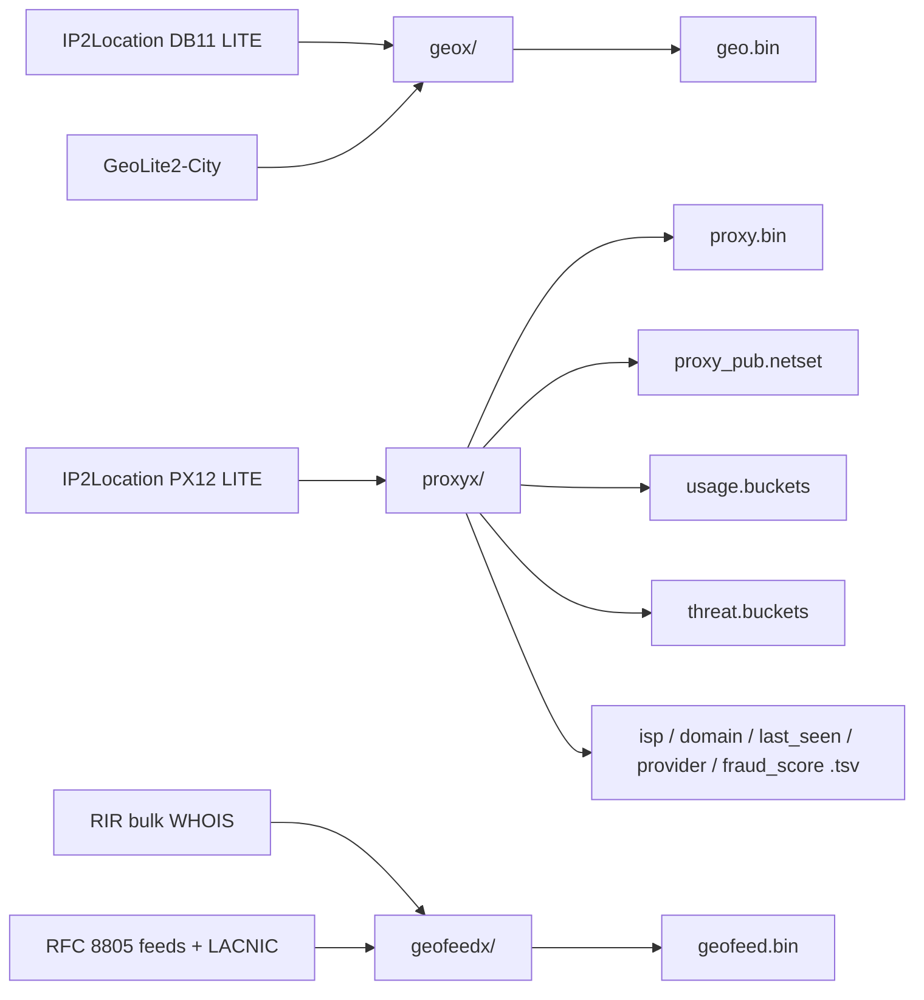

# IP2X

[](https://github.com/tn3w/IP2X/actions)
[](https://github.com/tn3w/IP2X/releases/latest)
[](https://github.com/tn3w/IP2X/releases/latest)
[](#artifacts)
[](#attribution)
[](LICENSE)

[](https://github.com/tn3w/IP2X/releases/latest/download/geo.bin)
[](https://github.com/tn3w/IP2X/releases/latest/download/proxy.bin)
[](https://github.com/tn3w/IP2X/releases/latest/download/geofeed.bin)
[](https://github.com/tn3w/IP2X/releases/latest/download/proxy_pub.netset)
[](https://github.com/tn3w/IP2X/releases/latest/download/usage.buckets)
[](https://github.com/tn3w/IP2X/releases/latest/download/threat.buckets)
[](https://github.com/tn3w/IP2X/releases/latest/download/isp.tsv)
[](https://github.com/tn3w/IP2X/releases/latest/download/domain.tsv)
[](https://github.com/tn3w/IP2X/releases/latest/download/last_seen.tsv)
[](https://github.com/tn3w/IP2X/releases/latest/download/provider.tsv)
[](https://github.com/tn3w/IP2X/releases/latest/download/fraud_score.tsv)

Public IP intel repacked for fast offline use. Three crates: mmap binary
DBs (`geo.bin`, `proxy.bin`, `geofeed.bin`) and plain-text proxy views
(≤ 38 MB each). Sources: IP2Location LITE, MaxMind GeoLite2, RIR geofeeds.

```bash
wget https://github.com/tn3w/IP2X/releases/latest/download/geo.bin
wget https://github.com/tn3w/IP2X/releases/latest/download/proxy.bin
wget https://github.com/tn3w/IP2X/releases/latest/download/geofeed.bin
wget https://github.com/tn3w/IP2X/releases/latest/download/proxy_pub.netset
wget https://github.com/tn3w/IP2X/releases/latest/download/usage.buckets
wget https://github.com/tn3w/IP2X/releases/latest/download/threat.buckets
wget https://github.com/tn3w/IP2X/releases/latest/download/isp.tsv
wget https://github.com/tn3w/IP2X/releases/latest/download/domain.tsv
wget https://github.com/tn3w/IP2X/releases/latest/download/last_seen.tsv
wget https://github.com/tn3w/IP2X/releases/latest/download/provider.tsv
wget https://github.com/tn3w/IP2X/releases/latest/download/fraud_score.tsv
```

Updated daily via GitHub Actions.

## Artifacts

| file | role | size |
| ---- | ---- | ---: |
| `geo.bin`            | mmap DB, IP → (lat, lon) at 0.001° | ~42 MB |
| `proxy.bin`          | mmap DB, IP → (isp, domain)        | ~12 MB |
| `geofeed.bin`        | mmap DB, IP → (country, region, city, postal, feed) | ~11 MB |
| `proxy_pub.netset`   | CIDR netset, public proxies (proxy_type == PUB) | ~31 MB |
| `usage.buckets`      | IP → usage  (bucketed per value)    | ~27 MB |
| `threat.buckets`     | IP → threat (bucketed per value)    | ~0.5 MB |
| `isp.tsv`            | IP → ISP            (dict + ranges) | ~34 MB |
| `domain.tsv`         | IP → domain         (dict + ranges) | ~33 MB |
| `last_seen.tsv`      | IP → last-seen days (dict + ranges) | ~38 MB |
| `provider.tsv`       | IP → VPN provider   (dict + ranges) | ~0.3 MB |
| `fraud_score.tsv`    | IP → fraud score    (dict + ranges) | ~37 MB |

# geo.bin

Built by [`geox/`](geox/) from IP2Location DB11 LITE (preferred) +
MaxMind GeoLite2-City (fallback). Coordinates quantised to 0.001°
(~111 m, village-scale). Self-describing little-endian, magic `GEO1`.

## Layout

24 B header. IPv4 stored as `(base u32) + (delta u24)` blocks of ≤ 256
rows; IPv6 keyed on the upper 64 bits. Bit-packed point indices into a
deduped `(lat, lon)` table of i24/1000.

| offset | size | field |
| -----: | ---- | ----- |
| 0  | 4    | magic `GEO1` |
| 4  | u8   | version (1) |
| 5  | u8   | minor (3) |
| 6  | u8   | idx_bits |
| 7  | u8   | reserved |
| 8  | u32  | point_count |
| 12 | u32  | v4_row_count |
| 16 | u32  | v6_row_count |
| 20 | u32  | v4_block_count |

Then: points (`6 B × point_count`), v4 bases (`4 B × blocks`), v4 offsets
(`4 B × (blocks+1)`), v4 deltas (`3 B × rows`), v4 packed idx,
v6 keys (`8 B × rows`), v6 packed idx.

Lookup v4: bisect `v4_bases`, bisect deltas inside the matched block,
read packed idx, decode point. Lookup v6: bisect upper-64 keys, read
packed idx, decode point. ~0.2 MB resident at open; pages fault on demand.

## Build

```bash
cd geox
cargo build --release

./target/release/geox build \
    --ip2l IP2LOCATION-LITE-DB11.IPV6.BIN \
    --mmdb GeoLite2-City.mmdb \
    --out  geo.bin

./target/release/geox lookup --db geo.bin 8.8.8.8
# 37.386, -122.084
```

## Python lookup ([`geo_lookup.py`](geo_lookup.py))

mmap + numpy `searchsorted` on v4 bases / v6 upper-64 keys; manual
bit-packed idx + i24 decode. No preload, near-instant startup.

```bash
python3 geo_lookup.py 8.8.8.8 2001:4860:4860::8888
# 8.8.8.8                  37.386, -122.084
# 2001:4860:4860::8888     37.386, -122.084
```

`--db PATH` to point at a non-default `geo.bin`.

# proxy.bin

Built by [`proxyx/`](proxyx/) from IP2Location IP2PROXY-LITE-PX12.
Compact mmap DB, IP → (isp, domain). Magic `PRX2`, little-endian, ~12 MB
for the full PX12 dataset (3.88M v4 rows + 7.8k v6 rows after
adjacent-equal merge).

## Layout

36 B header. Strings interned once into a single offset/blob table;
(isp_idx, dom_idx) pairs interned into a pair table, freq-sorted so hot
pairs get tiny indices. IPv4 stored as fixed-size blocks of 256 rows
with per-block variable bit-width deltas and pair-index packing; IPv6
keyed on the upper 64 bits.

| offset | size | field |
| -----: | ---- | ----- |
| 0  | 4   | magic `PRX2` |
| 4  | u8  | version (2) |
| 5  | u8  | block_shift (8 → 256 rows) |
| 6  | u8  | v6_bits |
| 7  | u8  | reserved |
| 8  | u32 | pair_count |
| 12 | u32 | str_count |
| 16 | u32 | v4_row_count |
| 20 | u32 | v6_row_count |
| 24 | u32 | v4_block_count |
| 28 | u32 | v4_delta_blob_len |
| 32 | u32 | v4_idx_blob_len |

Then: pairs (`6 B × n_pairs`, u24 isp_idx + u24 dom_idx), str offsets
(`4 B × (n_strs+1)`), str blob, v4 bases (`4 B × blocks`), per-block
`dbits` / `ibits` (`1 B × blocks` each), v4 delta byte-offsets and
idx byte-offsets (`4 B × (blocks+1)` each), v4 delta blob + 8 B pad,
v4 idx blob + 8 B pad, v6 keys (`8 B × rows`), v6 packed idx + 8 B pad.

Avg per-block widths on full PX12: ~14 delta-bits, ~8 idx-bits.

Lookup v4: bisect `bases4`, bisect deltas in the matched block at that
block's `dbits`, read packed pair-idx at that block's `ibits`, resolve
pair → (isp, domain). Lookup v6: bisect upper-64 keys, read packed idx,
resolve pair. Native lookup ~170 ns v4 / ~80 ns v6; load ~10 µs;
resident struct 208 B (mmap shared, paged on demand).

## Build

```bash
cd proxyx
cargo build --release

./target/release/proxyx build-db \
    --px12 IP2PROXY-LITE-PX12.BIN \
    --out  proxy.bin

./target/release/proxyx lookup --db proxy.bin 1.0.19.98
# isp     I2TS Inc.
# domain  mediaindex.co.jp
```

## Python lookup ([`proxy_db_lookup.py`](proxy_db_lookup.py))

mmap + numpy `searchsorted` on bases4 / v6 upper-64 keys; manual
bit-packed delta + idx decode against per-block widths. No preload,
near-instant startup.

```bash
python3 proxy_db_lookup.py 1.0.19.98 2001:dead::1
# 1.0.19.98     isp=I2TS Inc.            domain=mediaindex.co.jp
# 2001:dead::1  isp=FDCservers.net LLC   domain=fdcservers.net
```

`--db PATH` to point at a non-default `proxy.bin`.

# geofeed.bin

Built by [`geofeedx/`](geofeedx/) from operator-published geolocation.
The builder downloads the RIR bulk WHOIS dumps (RIPE, APNIC, AFRINIC),
extracts every `geofeed:` / `remarks: Geofeed` reference, fetches each
referenced [RFC 8805](https://www.rfc-editor.org/rfc/rfc8805) feed
concurrently, and merges the LACNIC consolidated feed. Self-describing
little-endian, magic `GFD3`, IPv4 + IPv6.

Feed rows are accepted only when contained in the authority range of the
RIR object that referenced them. Each row contributes
`(country, region, city, postal, feed, rir)`; `feed` is the source URL.

## Layout

28 B header. `(country, region, city, postal, feed, rir)` tuples are
interned into a freq-sorted record table (hot records get small ids), and
every string is interned once into an offset/blob table. IPv4 and IPv6
ranges are each flattened into a sorted breakpoint array (`start → record
id`); adjacent-equal ids are merged. Id and field-index widths are the
minimum bytes the cardinalities require (typically 2 B each).

| offset | size | field |
| -----: | ---- | ----- |
| 0  | 4   | magic `GFD3` |
| 4  | u8  | version (3) |
| 5  | u8  | id_width |
| 6  | u8  | field_count (6) |
| 7  | u8  | field_width |
| 8  | u32 | v4_break_count |
| 12 | u32 | v6_break_count |
| 16 | u32 | record_count |
| 20 | u32 | string_count |
| 24 | u32 | blob_len |

Then: v4 starts (`4 B × v4_breaks`), v4 ids (`id_width × v4_breaks`),
v6 starts (`16 B × v6_breaks`), v6 ids (`id_width × v6_breaks`),
records (`field_count × field_width × records`), string offsets
(`4 B × (strings+1)`), string blob.

Lookup: bisect the matching family's starts, read the packed record id,
resolve the tuple. Native load ~6 µs (mmap, ~0 resident); ~120 ns/lookup
over ~1.2 M v4 breakpoints.

## Build

```bash
cd geofeedx
cargo build --release

./target/release/geofeedx fetch --out geofeeds_data.csv
./target/release/geofeedx build --data geofeeds_data.csv --out geofeed.bin

./target/release/geofeedx lookup --db geofeed.bin 213.21.192.5
# country  LV
# region   LV-RIX
# city     Riga
# ...
```

`fetch` caches the RIR bulk dumps under `.cache/rir-bulk` and re-downloads
only what is missing. `geofeeds_data.csv` is the intermediate
`cidr,country,region,city,postal,feed,rir` join, regenerated on each fetch.

## Python lookup ([`geofeed_lookup.py`](geofeed_lookup.py))

mmap + `bisect` on the v4 / v6 start arrays; variable-width record and
field decode. No preload, near-instant startup. v4 + v6 in one call.

```bash
python3 geofeed_lookup.py 213.21.192.5 2001:ad0::1
```

`--db PATH` to point at a non-default `geofeed.bin`.

# proxyx outputs

Built by [`proxyx/`](proxyx/) from IP2Location IP2PROXY-LITE-PX12.
All files plain UTF-8, `#`-prefixed metadata header, ≤ 38 MB each
(no compression, no splitting). Empty source fields dropped; adjacent
ranges with identical value merged.

Three shapes used across the files:

### Netset (`proxy_pub.netset`)

Standard CIDR list, one network per line, single IPs as bare addresses.
`#`-prefixed metadata header. Drop-in for `ipset hash:net`,
`iptables`/`nftables`, `ufw`, pfSense and similar.

```bash
ipset create proxy_pub hash:net family inet
awk '!/^#/ && /\./' proxy_pub.netset | xargs -n1 ipset add proxy_pub
```

### Bucketed form (`usage.buckets`, `threat.buckets`)

```
[VALUE]
<start_ip>[+<span>]
<start_ip>[+<span>]
[NEXT_VALUE]
...
```

For low-cardinality categorical fields. IP → value = scan sections,
bisect ranges. The string is written once per category, not per range.

### Dict + ranges form (`*.tsv`)

```
#dict
<idx>\t<value>
<idx>\t<value>
#data
<start_ip>[+<span>]\t<idx>
```

`#dict` is frequency-sorted (smaller idx = more common, so popular
values cost 1-2 chars per row). `#data` is v4 block then v6, ascending.
Lookup: load the dict into a `Vec<String>`, bisect `#data` by `start_ip`,
index into the dict.

## Field source

PX12 columns kept by `proxyx` (others ignored):

| file | PX12 column |
| ---- | ----------- |
| `proxy_pub.netset` | `proxy_type` filtered to `PUB` |
| `usage.buckets`    | `usage_type` |
| `threat.buckets`   | `threat` |
| `isp.tsv`          | `isp` |
| `domain.tsv`       | `domain` |
| `last_seen.tsv`    | `last_seen` (days) |
| `provider.tsv`     | `provider` |
| `fraud_score.tsv`  | `fraud_score` (0-99) |

Country/region/city/ASN/AS-name are intentionally omitted — `geo.bin`
already covers location, ASN lives elsewhere.

## Build

```bash
cd proxyx
cargo build --release

./target/release/proxyx build \
    --px12 IP2PROXY-LITE-PX12.BIN \
    --out  out/

ls -lh out/
```

## Python lookup ([`proxy_lookup.py`](proxy_lookup.py))

Parses all 8 outputs once into sorted (start, end, val) arrays; bisects
per file on query. v4 + v6 in one call. Load ~8 s for the full bundle,
lookup O(log n) per file thereafter.

```bash
python3 proxy_lookup.py 1.0.19.98
# proxy_pub    True
# isp          I2TS Inc.
# domain       mediaindex.co.jp
# last_seen    30
# fraud_score  80
# usage        DCH
# ...
```

`--dir PATH` to point at a directory other than `.`.

# Pipeline



# Automated updates

[`.github/workflows/build.yml`](.github/workflows/build.yml):

1. Loops over IP2Location LITE downloads (`DB11LITEBINIPV6`,
   `PX12LITEBIN`) using `IP2LOCATION_TOKEN`.
2. Pulls `GeoLite2-City.mmdb` from a public mirror.
3. Builds `geo.bin` with `geox`, plus `proxy.bin` and the eight
   plain-text views with `proxyx`.
4. Runs `geofeedx fetch` (RIR bulk + RFC 8805 feeds) then `geofeedx
   build` to produce `geofeed.bin`.
5. Publishes a timestamped release with all eleven assets; prunes to the
   latest 5.

# Attribution

Geo data: [IP2Location LITE](https://lite.ip2location.com) DB11 +
[MaxMind GeoLite2](https://dev.maxmind.com/geoip/geolite2-free-geolocation-data).
Proxy data: IP2Location LITE PX12.
Geofeed data: RIR bulk WHOIS (RIPE, APNIC, AFRINIC, LACNIC) +
operator-published [RFC 8805](https://www.rfc-editor.org/rfc/rfc8805) feeds.

# License

[Apache-2.0](LICENSE).
