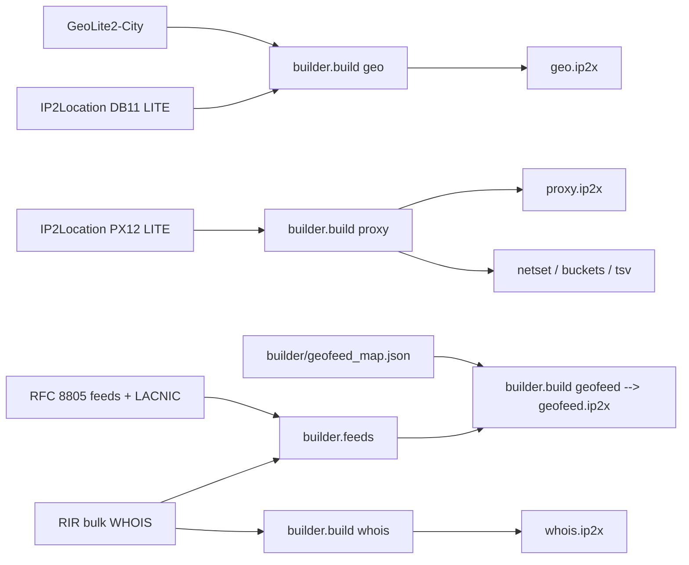

# IP2X

[](https://github.com/tn3w/IP2X/actions)
[](https://github.com/tn3w/IP2X/releases/latest)
[](https://github.com/tn3w/IP2X/releases/latest)
[](#artifacts)
[](#attribution)
[](LICENSE)

[](https://github.com/tn3w/IP2X/releases/latest/download/geo.ip2x)
[](https://github.com/tn3w/IP2X/releases/latest/download/proxy.ip2x)
[](https://github.com/tn3w/IP2X/releases/latest/download/geofeed.ip2x)
[](https://github.com/tn3w/IP2X/releases/latest/download/whois.ip2x)
[](https://github.com/tn3w/IP2X/releases/latest/download/proxy_pub.netset)
[](https://github.com/tn3w/IP2X/releases/latest/download/usage.buckets)
[](https://github.com/tn3w/IP2X/releases/latest/download/threat.buckets)
[](https://github.com/tn3w/IP2X/releases/latest/download/isp.tsv)
[](https://github.com/tn3w/IP2X/releases/latest/download/domain.tsv)
[](https://github.com/tn3w/IP2X/releases/latest/download/asn.tsv)
[](https://github.com/tn3w/IP2X/releases/latest/download/as_name.tsv)
[](https://github.com/tn3w/IP2X/releases/latest/download/last_seen.tsv)
[](https://github.com/tn3w/IP2X/releases/latest/download/provider.tsv)
[](https://github.com/tn3w/IP2X/releases/latest/download/fraud_score.tsv)

Public IP intel repacked for fast offline use. Four mmap databases in one
container format, read by one stdlib-only file. Sources: IP2Location LITE,
MaxMind GeoLite2, RIR geofeeds and bulk WHOIS.

```bash
wget https://github.com/tn3w/IP2X/releases/latest/download/geo.ip2x
wget https://github.com/tn3w/IP2X/releases/latest/download/proxy.ip2x
wget https://github.com/tn3w/IP2X/releases/latest/download/geofeed.ip2x
wget https://github.com/tn3w/IP2X/releases/latest/download/whois.ip2x
wget https://github.com/tn3w/IP2X/releases/latest/download/proxy_pub.netset
wget https://github.com/tn3w/IP2X/releases/latest/download/usage.buckets
wget https://github.com/tn3w/IP2X/releases/latest/download/threat.buckets
wget https://github.com/tn3w/IP2X/releases/latest/download/isp.tsv
wget https://github.com/tn3w/IP2X/releases/latest/download/domain.tsv
wget https://github.com/tn3w/IP2X/releases/latest/download/asn.tsv
wget https://github.com/tn3w/IP2X/releases/latest/download/as_name.tsv
wget https://github.com/tn3w/IP2X/releases/latest/download/last_seen.tsv
wget https://github.com/tn3w/IP2X/releases/latest/download/provider.tsv
wget https://github.com/tn3w/IP2X/releases/latest/download/fraud_score.tsv

python3 ip2x.py --db geo.ip2x 8.8.8.8
# 8.8.8.8	{"lat": 37.386, "lon": -122.084}
```

Updated daily via GitHub Actions.

## Artifacts

| file | role | size |
| ---- | ---- | ---: |
| `geo.ip2x`     | IP → lat, lon at 0.001°                    | 5.1 MB |
| `proxy.ip2x`   | IP → proxy type, ISP, domain, usage, ASN, AS name, last seen, threat, provider, fraud score | 4.4 MB |
| `geofeed.ip2x` | IP → country, region, city, postal, feed, RIR, provider, tags | 1.2 MB |
| `whois.ip2x`   | IP → netname, org, descr, country, status, RIR of the narrowest registry object | 76 MB |
| `proxy_pub.netset` | CIDR netset, public proxies (`proxy_type == PUB`) | 40 MB |
| `usage.buckets`    | IP → usage type (bucketed per value)  | 35 MB |
| `threat.buckets`   | IP → threat     (bucketed per value)  | 0.7 MB |
| `isp.tsv` `domain.tsv` `asn.tsv` `as_name.tsv` `last_seen.tsv` `provider.tsv` `fraud_score.tsv` | dict + ranges, one per field | ≤ 47 MB |

The `.ip2x` files answer everything the text views do, smaller and faster. The
views exist to stay greppable and to feed `ipset`/`iptables` directly.

> [!TIP]
> Releases up to the format change shipped `geo.bin`, `proxy.bin` and
> `geofeed.bin` in the old per-database formats (`GEO1`, `PRX2`, `GFD3`). Those
> names are no longer published and the old readers cannot read the new format.
> Migrate: download `geo.ip2x`, `proxy.ip2x`, `geofeed.ip2x` instead and switch
> to [`ip2x.py`](ip2x.py), which replaces every previous reader.

# Format

One container, magic `IP2X\x01`, little-endian, used by all four databases.

```
"IP2X\x01"   5 B magic
u32          header length
JSON header
section bodies, concatenated
```

The header names every section and how to read it, so a reader needs no
per-database knowledge. Each section body:

```
u32                    block count
u32                    key width (4 or 16 for an index, else 0)
u32                    dictionary length
u32 × (blocks + 1)     block end offsets
key × blocks           big-endian, key width bytes   (index only)
zstd dictionary
zstd blocks
```

Every section trains its own zstd dictionary (≤ 112 KB) against its blocks and
keeps it only where it pays for itself; blocks are zstd level 19. Small blocks
against a shared dictionary is what keeps random access cheap without paying the
usual small-block compression penalty.

## Encodings

| encoding | block | payload |
| -------- | ----: | ------- |
| `index`  | 1024 addresses | gaps from the block key as varints; for IPv6 the top 64 bits are gap-coded and the low 64 follow as varints |
| `plain`  | 65536 values | one width byte (1/2/4/8), then fixed-width values |
| `step`   | 65536 values | the same, over differences from the previous value |
| `text`   | 1024 strings | front-coded: shared-prefix byte, varint fresh length, bytes; restarts each block |

`plain` and `step` are written both ways and the smaller is kept.

## Shape

All four databases have the same shape, which is why one reader covers them:

| section | holds |
| ------- | ----- |
| `spine.v4` `spine.v6` | sorted range starts |
| `row.v4` `row.v6`     | record id per range, 0 where nothing is known |
| `field.<name>`        | one column per field, over the record table |
| `strings`             | the shared pool every text field indexes into |

Records are deduplicated and numbered **by first appearance**, so the ids inside
one block stay close together and zstd sees them repeat. Frequency ordering was
measured 4% worse.

Lookup: bisect the block keys, decode that block, bisect it, read the record id,
read each field column at `id - 1`.

# geo.ip2x

IP2Location DB11 LITE where it holds a point, MaxMind GeoLite2-City where DB11
has `0,0`. Coordinates quantised to 0.001° into a deduplicated point table.

Boundaries are snapped to **/24 for IPv4 and /40 for IPv6**, each block taking
the point that covers most of it. The IPv6 snap is what makes the file small:
IP2Location LITE's v6 table is per-/48 customer churn, 3.0M boundaries
alternating between points in the same metro:

```
2001:9e8:d366::  (51.925, 9.108)
2001:9e8:d367::  (52.007, 8.546)
2001:9e8:d368::  (51.925, 9.108)
```

Snapping to /40 cuts 3.0M v6 boundaries to 144k and 3.9 MB off the file, for
detail the source cannot support.

| | |
| --- | --- |
| v4 boundaries | 2,938,618 |
| v6 boundaries | 144,153 |
| distinct points | 87,555 |

Without snapping (`--v4-block 0 --v6-block 0`) the same builder writes 8.8 MB.

# proxy.ip2x

IP2Location LITE PX12, all ten fields kept, adjacent rows with identical values
merged. 5.27M v4 and 5.4k v6 boundaries over 100k distinct records.

```bash
python3 ip2x.py --db proxy.ip2x 1.0.19.98
```
```json
{"proxy_type": "PUB", "isp": "I2TS Inc.", "domain": "mediaindex.co.jp",
 "usage_type": "DCH", "asn": null, "as_name": null, "last_seen": 30,
 "threat": null, "provider": null, "fraud_score": 80}
```

Country, region and city are omitted - `geo.ip2x` and `geofeed.ip2x` cover
location.

# geofeed.ip2x

`builder/feeds.py` downloads the RIR bulk WHOIS dumps (RIPE, APNIC, AFRINIC), extracts
every `geofeed:` / `remarks: Geofeed` reference, fetches each referenced
[RFC 8805](https://www.rfc-editor.org/rfc/rfc8805) feed concurrently and merges
the LACNIC consolidated feed. A feed row is kept only when it falls inside the
authority range of the object that referenced it.

Feeds nest and overlap, so ranges are flattened into breakpoints before writing.
`provider` and `tags` come from [`builder/geofeed_map.json`](builder/geofeed_map.json), which
maps a feed URL to its operator and network type (`isp`, `hosting`,
`datacenter`, `enterprise`, `mobile`, `cloud`, …).

```bash
python3 -m builder.feeds                        # → geofeeds_data.csv, geofeeds.csv
python3 -m builder.build geofeed                # → geofeed.ip2x
python3 ip2x.py --db geofeed.ip2x 213.21.192.5
```

`builder/feeds.py` caches the bulk dumps under `.cache/rir-bulk` and re-downloads only
what is missing. Each feed is parsed once however many registry objects point at
it, which is what keeps the join to seconds rather than an hour.

| | |
| --- | --- |
| references discovered | 86,860 over 5,251 unique feeds |
| feeds reached | 4,488 |
| feed rows kept | 581,292 |
| v4 / v6 breakpoints | 364,849 / 258,979 |
| records | 60,578 |

Where two operators publish overlapping ranges, the most specific wins; equal
ranges that disagree are resolved in feed order.

# whois.ip2x

The narrowest RIPE, APNIC or AFRINIC `inetnum`/`inet6num` object over each
address: customer assignments such as `CLOUD-FSN1` inside Hetzner's allocation,
far finer than an ASN or an announced prefix.

```bash
python3 -m builder.build whois                  # reuses builder.feeds' dump cache
python3 ip2x.py --db whois.ip2x 2a01:4f8:c17::1
```
```json
{"netname": "CLOUD-FSN1", "org": "Hetzner Online GmbH", "descr": null,
 "country": "DE", "status": "ASSIGNED PA", "rir": "RIPE"}
```

| field | from |
| ----- | ---- |
| `netname`, `descr`, `country`, `status` | the object's first value of each key |
| `org` | `org-name` of the object's `organisation` |
| `rir` | the dump it came from |

- **Nested** objects: the narrowest wins, the covering one answers around it.
- **Stubs dropped:** objects wider than /8 (v4) or /24 (v6), `IANA-*`,
  `NON-RIPE-NCC*`, `ERX-NETBLOCK*`, `ARIN-CIDR-BLOCK*` netnames and "not allocated
  to" descriptions name no holder.
- ARIN and LACNIC publish no bulk holder data, so their space answers `None`.

About 4.0M records over 6.5M v4 and 1.4M v6 boundaries.

# Text views

Plain UTF-8, `#`-prefixed metadata header, no compression, no splitting. Empty
values dropped; adjacent ranges with identical values merged.

### Netset (`proxy_pub.netset`)

One CIDR per line, single IPs bare. Drop-in for `ipset hash:net`, `iptables`,
`nftables`, `ufw`, pfSense.

```bash
ipset create proxy_pub hash:net family inet
awk '!/^#/ && /\./' proxy_pub.netset | xargs -n1 ipset add proxy_pub
```

### Bucketed (`usage.buckets`, `threat.buckets`)

```
[VALUE]
<start_ip>[+<span>]
[NEXT_VALUE]
```

For low-cardinality fields: the string is written once per category, not per
range.

### Dict + ranges (`*.tsv`)

```
#dict
<idx>\t<value>
#data
<start_ip>[+<span>]\t<idx>
```

`#dict` is frequency-sorted, so common values cost 1-2 characters per row.
`#data` is the v4 block then v6, ascending. Lookup: load the dict, bisect
`#data` by start_ip.

These are deliberately **not** minified. The start-IP column is 75-93% of each
file and delta-coding it would cut them to ~21%, but that breaks the bisect and
the `grep` those formats exist for - and `proxy.ip2x` already answers the same
questions in 4.4 MB.

# Reading

[`ip2x.py`](ip2x.py) reads all four databases and every text view. Standard library only on Python 3.14,
where `compression.zstd` ships; `pyzstd` below it. mmap, no preload.

```python
from ip2x import Database

database = Database("geo.ip2x")
database.lookup("8.8.8.8")              # {"lat": 37.386, "lon": -122.084}
database.lookup("2001:4860:4860::8888") # same, v4 and v6 in one call
database.lookup("0.0.0.1")              # None
```

Open 0.3-1.3 ms, 3-23 µs for a cold lookup, 1.0-1.6 µs once the block is cached.
Decoded blocks are kept in a bounded cache, so a log reading nearby addresses
pays for one decode.

The same file also reads the text views, so a script needs no second parser:

```python
from ip2x import View, open_source

View("proxy_pub.netset").lookup("1.0.19.98")  # "PUB" or None
View("usage.buckets").lookup("1.0.19.98")     # "DCH"
View("isp.tsv").lookup("1.0.19.98")           # "I2TS Inc."

open_source("geo.ip2x")                        # Database or View, by suffix
```

```bash
python3 ip2x.py --db isp.tsv 1.0.19.98
```

`.netset`, `.buckets` and `.tsv` are picked apart by suffix and held as sorted
ranges per family; lookup bisects. Unlike the databases a view is parsed whole
at open (seconds and hundreds of MB for the large tables), so prefer the `.ip2x`
files for anything hot.

# Building

`numpy` is needed to build; reading never needs it.

```bash
uv sync --extra build          # or: pip install numpy

python3 -m builder.build geo   --ip2l IP2LOCATION-LITE-DB11.IPV6.BIN \
                               --mmdb GeoLite2-City.mmdb --out geo.ip2x
python3 -m builder.build proxy --px12 IP2PROXY-LITE-PX12.BIN --out proxy.ip2x \
                               --views views/
python3 -m builder.feeds && python3 -m builder.build geofeed
python3 -m builder.build whois
```

Everything that writes lives in [`builder/`](builder/); the reader stays one
file at the root, so vendoring it means copying [`ip2x.py`](ip2x.py) alone.

| file | does |
| ---- | ---- |
| [`ip2x.py`](ip2x.py) | the reader, the views, and the CLI |
| [`builder/pack.py`](builder/pack.py) | the container writer: blocks, dicts, header |
| [`builder/sources.py`](builder/sources.py) | IP2Location `.BIN` and MaxMind `.mmdb` parsing |
| [`builder/build.py`](builder/build.py) | the four builders |
| [`builder/views.py`](builder/views.py) | the plain-text views |
| [`builder/feeds.py`](builder/feeds.py) | RIR geofeed discovery and fetch, bulk dump cache |
| [`builder/region_country.py`](builder/region_country.py) | cloud region → country code |
| [`test_ip2x.py`](test_ip2x.py) | round-trips every section kind and view |

`builder.build geo` takes ~50 s, `builder.build proxy` ~25 s and 5 GB peak.

# Pipeline


```mermaid
flowchart LR
    D1[IP2Location DB11 LITE] --> G[builder.build geo]
    D2[GeoLite2-City] --> G
    G --> GB[geo.ip2x]
    D3[IP2Location PX12 LITE] --> P[builder.build proxy]
    P --> PB[proxy.ip2x]
    P --> V[netset / buckets / tsv]
    D4[RIR bulk WHOIS] --> F[builder.feeds]
    D5[RFC 8805 feeds + LACNIC] --> F
    F --> FB[builder.build geofeed --> geofeed.ip2x]
    D4 --> W[builder.build whois] --> WB[whois.ip2x]
    D6[builder/geofeed_map.json] --> FB
```

# builder/region_country.py

Maps a cloud datacenter region to an ISO 3166-1 alpha-2 country code. Covers AWS,
GCP and Azure naming via a built-in table, then falls back to parsing the region
string: ISO codes, country names ([pycountry](https://pypi.org/project/pycountry/))
and city names ([geonamescache](https://pypi.org/project/geonamescache/)).

```python
from region_country import country

country("ap-east-1")     # HK
country("europe-west3")  # DE
```

# Attribution

Geo data: [IP2Location LITE](https://lite.ip2location.com) DB11 +
[MaxMind GeoLite2](https://dev.maxmind.com/geoip/geolite2-free-geolocation-data).
Proxy data: IP2Location LITE PX12.
Geofeed data: RIR bulk WHOIS (RIPE, APNIC, AFRINIC, LACNIC) +
operator-published [RFC 8805](https://www.rfc-editor.org/rfc/rfc8805) feeds.
WHOIS data: RIPE NCC, APNIC and AFRINIC bulk dumps, under each registry's terms.

# License

[Apache-2.0](LICENSE).
